# Browser Copilot: Simplified ReAct Flow for Test Automation

This diagram illustrates the core ReAct (Reason + Act) pattern used in Browser Copilot for executing browser automation tests, including human-in-the-loop capabilities.

```mermaid
---
config:
  layout: fixed
---
flowchart LR
 subgraph PlaywrightServer["🎭 Playwright MCP Server"]
        Browser["Browser Instance<br>━━━━━━━━━<br>• navigate<br>• click/type<br>• snapshot<br>• screenshot"]
  end
 subgraph Reason["🤔 Reason"]
        Reason1["Analyze current state<br>Plan next action<br>Select appropriate tool"]
  end
 subgraph Act["⚡ Act"]
        ToolExec{"Execute Tool"}
        PlaywrightMCPClient[["Playwright<br>MCP Client"]]
        AskHumanClient[["ask_human<br>Tool"]]
  end
 subgraph Observe["👁️ Observe"]
        ObserveResult["Capture tool response<br>Update agent state"]
  end
 subgraph ReActLoop["🔄 ReAct Agentic Loop"]
        Reason
        Act
        Observe
  end
 subgraph InputSources["👥 Human in the loop"]
        Human["👤 Human<br>Operator"]
        LLMProxy["🤖 LLM<br>(Acting as Human)"]
  end
    ToolExec L_ToolExec_PlaywrightMCPClient_0@--> PlaywrightMCPClient & AskHumanClient
    Reason1 L_Reason1_ToolExec_0@--> ToolExec
    PlaywrightMCPClient L_PlaywrightMCPClient_ObserveResult_0@--> ObserveResult
    AskHumanClient L_AskHumanClient_ObserveResult_0@--> ObserveResult
    ObserveResult L_ObserveResult_Reason1_0@-.-> Reason1
    TestSuite(["Test Suite <br>(Natural Language)"]) L_TestSuite_Reason1_0@--> Reason1
    Reason1 L_Reason1_Report_0@-..-> Report(["Test Report<br>(Markdown, JSON, HTML)"])
    Browser L_Browser_PlaywrightMCPClient_0@-..-> PlaywrightMCPClient
    PlaywrightMCPClient -. MCP Protocol<br>(stdio) .-> Browser
    AskHumanClient L_AskHumanClient_Human_0@-. Manual Mode .-> Human
    AskHumanClient L_AskHumanClient_LLMProxy_0@-. Auto Mode .-> LLMProxy
    Human -..-> AskHumanClient
    LLMProxy -..-> AskHumanClient
    n1["Browser Copilot<br>-- A new paradigm for test automation--"]
    n1@{ shape: text}
     Browser:::external
     Reason1:::reason
     ToolExec:::act
     PlaywrightMCPClient:::client
     AskHumanClient:::client
     ObserveResult:::observe
     Human:::external
     LLMProxy:::external
    classDef startEnd fill:#e1f5e1,stroke:#4caf50,stroke-width:3px
    classDef reason fill:#e3f2fd,stroke:#2196f3,stroke-width:2px
    classDef act fill:#f3e5f5,stroke:#9c27b0,stroke-width:2px
    classDef observe fill:#fff9c4,stroke:#f57f17,stroke-width:2px
    classDef client fill:#fff3e0,stroke:#ff9800,stroke-width:2px
    classDef external fill:#e8eaf6,stroke:#5c6bc0,stroke-width:2px
    classDef report fill:#e0f2f1,stroke:#00897b,stroke-width:2px
    style Reason fill:#e3f2fd,stroke:#1976d2,stroke-width:2px
    style Act fill:#f3e5f5,stroke:#7b1fa2,stroke-width:2px
    style Observe fill:#fff9c4,stroke:#f57f17,stroke-width:2px
    style n1 color:#000000,stroke-width:1px,stroke-dasharray: 1,fill:#C8E6C9
    style ReActLoop fill:#f5f5f5,stroke:#333,stroke-width:3px,stroke-dasharray: 5 5
    style PlaywrightServer fill:#e8eaf6,stroke:#5c6bc0,stroke-width:2px
    style InputSources fill:#fce4ec,stroke:#e91e63,stroke-width:2px
    L_ToolExec_PlaywrightMCPClient_0@{ animation: fast }
    L_ToolExec_AskHumanClient_0@{ animation: fast }
    L_Reason1_ToolExec_0@{ animation: slow }
    L_PlaywrightMCPClient_ObserveResult_0@{ animation: slow }
    L_AskHumanClient_ObserveResult_0@{ animation: slow }
    L_ObserveResult_Reason1_0@{ animation: fast }
    L_TestSuite_Reason1_0@{ animation: fast }
    L_Reason1_Report_0@{ animation: fast }
    L_Browser_PlaywrightMCPClient_0@{ animation: fast }
    L_AskHumanClient_Human_0@{ animation: slow }
    L_AskHumanClient_LLMProxy_0@{ animation: slow }
```



## Architecture Overview

This diagram shows the complete architecture with the ReAct loop at its core and external systems:

### ReAct Agentic Loop (Internal)

The Browser Copilot follows the classic ReAct pattern with three phases:

1. **🤔 Reason**
   - Analyzes current state and test progress
   - Plans the next action based on test requirements
   - Selects appropriate tool (Playwright MCP or ask_human)

2. **⚡ Act**
   - Executes the selected tool through its client
   - **Playwright MCP Client**: Sends browser commands via MCP protocol
   - **ask_human Tool**: Routes to appropriate input source

3. **👁️ Observe**
   - Captures tool responses
   - Updates agent state for next iteration

### External Systems

1. **🎭 Playwright MCP Server**
   - Runs as separate process outside the ReAct loop
   - Receives commands via MCP protocol (stdio)
   - Controls actual browser instance
   - Returns execution results

2. **👥 Human in the loop**
   - **Human Operator**: Provides manual input when in manual mode
   - **LLM (Acting as Human)**: Generates contextually appropriate responses in auto mode

### Communication Patterns

- **Solid arrows (→)**: Internal flow within ReAct loop
- **Dashed arrows (⇢)**: External communication across system boundaries
- **MCP Protocol**: Standardized communication between client and server
- **Mode-based routing**: ask_human dynamically routes to Human or LLM based on HIL mode

## Key Insights

1. **Continuous Loop**: The agent cycles through Reason → Act → Observe until the test is complete or fails
2. **Tool Equality**: Both Playwright and ask_human are just tools - neither is special in the ReAct pattern
3. **Evaluation in Reasoning**: The agent evaluates observations as part of the Reason phase, not as a separate step
4. **Exit Conditions**: The loop exits only when reasoning determines the goal is achieved or an unrecoverable error occurs

## Example: ReAct Loop in Action

Here's how the loop works for a typical test scenario:

```markdown
Test Step: "Login to the application with valid credentials"

Loop 1:
🤔 Reason: Need to navigate to login page first
⚡ Act: Execute playwright.navigate("https://example.com/login")
👁️ Observe: Page loaded successfully

Loop 2:
🤔 Reason: Need to find and fill username field
⚡ Act: Execute playwright.snapshot() to analyze page
👁️ Observe: Found input field with id="username"

Loop 3:
🤔 Reason: Enter username into the field
⚡ Act: Execute playwright.type("#username", "testuser")
👁️ Observe: Text entered successfully

Loop 4:
🤔 Reason: Unexpected popup appeared, need guidance
⚡ Act: Execute ask_human("Unexpected popup. Should I close it?")
👁️ Observe: Received response "close" (via LLM suggestion)

Loop 5:
🤔 Reason: Close the popup and continue
⚡ Act: Execute playwright.click(".popup-close")
👁️ Observe: Popup closed, login form visible again

... continues until login complete
```

## Tool Examples in the ReAct Pattern

### Playwright Tool Usage
```
Reason: User wants to search for "AI testing"
Act: playwright.type("#search", "AI testing")
Observe: Search field populated

Reason: Need to submit search
Act: playwright.click("#search-button")
Observe: Search results page loaded
```

### ask_human Tool Usage
```
Reason: Test says "enter your email" but no specific email provided
Act: ask_human("What email should I enter for registration?")
Observe: "test@example.com" (LLM suggested based on test context)

Reason: Proceed with suggested email
Act: playwright.type("#email", "test@example.com")
Observe: Email field filled successfully
```

## Benefits of This Architecture

1. **Simplicity**: Clean separation of reasoning, action, and observation
2. **Flexibility**: Any tool can be plugged into the Act phase
3. **Adaptability**: The reasoning phase adjusts based on observations
4. **Transparency**: Each phase is distinct and observable
5. **Extensibility**: New tools can be added without changing the core pattern

The ReAct pattern ensures Browser Copilot can handle complex, dynamic web testing scenarios while maintaining a clear, predictable execution flow.
