# Browser Copilot - Making Browser Testing as Easy as Writing a Todo List 📝

*A New Paradigm for Test Automation*

---

## 🎯 Presentation Overview

**Target Audience**: QA Engineers
**Duration**: 30-45 minutes
**Goal**: Introduce Browser Copilot as an experimental approach to simplify test creation and execution

---

## 📋 Table of Contents

1. [The Testing Challenge We All Face](#1-the-testing-challenge-we-all-face)
2. [Introducing Browser Copilot](#2-introducing-browser-copilot)
3. [How It Works - The Architecture](#3-how-it-works---the-architecture)
4. [Writing Your First Natural Language Test](#4-writing-your-first-natural-language-test)
5. [Live Demo](#5-live-demo)
6. [Advanced Features](#6-advanced-features)
7. [Real-World Use Cases](#7-real-world-use-cases)
8. [Comparison with Traditional Approaches](#8-comparison-with-traditional-approaches)
9. [Getting Started](#9-getting-started)
10. [Q&A and Hands-On Lab](#10-qa-and-hands-on-lab)

---

## 1. Traditional Browser Testing Approach

### Current Requirements 📋
- **Development Environment**: Setting up IDE, package managers, and build tools
- **Programming Skills**: Proficiency in languages like Python, JavaScript, or Java
- **Framework Knowledge**: Understanding Selenium/Playwright APIs and patterns
- **Selector Strategies**: CSS selectors, XPath, and element identification methods
- **Code Maintenance**: Regular updates to test scripts as applications evolve

### A Typical Test Scenario
- **Goal**: "Test if users can successfully checkout on our e-commerce site"
- **Implementation**: Write test code with page objects, waits, assertions, and error handling
- **Result**: Functional test that requires programming expertise to create and maintain

---

## 2. Introducing Browser Copilot

### What If Testing Could Be... 🤔

```markdown
# SauceDemo Shopping Test

1. Navigate to https://www.saucedemo.com
2. Login with username "standard_user" and password "secret_sauce"
3. Add "Sauce Labs Backpack" to cart
4. Click on shopping cart
5. Proceed to checkout
6. Fill in: First Name "Test", Last Name "User", Zip "12345"
7. Verify total price is $32.39 (including tax)
8. Complete the purchase
```

**That's it. This IS your test script!**

### Key Benefits 🚀
- **Natural Language**: Write tests like you'd explain them to a colleague
- **AI-Powered**: Intelligent interpretation of your intentions
- **Reduced Maintenance**: Update test descriptions instead of code and selectors
- **Visual Execution**: Watch the AI navigate and interact with your app in real-time
- **Collaborative**: Everyone can read and contribute to tests

### Important Considerations 🤔
- **Cost**: LLM API usage costs ~$0.01-0.10 per test run (free with GitHub Copilot subscription!)
- **Execution Time**: Tests run slower than traditional scripts due to LLM processing
- **Non-Deterministic**: AI may interpret instructions differently between runs
- **Best For**: Exploratory testing, smoke tests, and scenarios that change frequently
- **Less Ideal For**: High-frequency regression tests or performance-critical suites

---

## 3. How It Works - The Architecture

### The Agentic Pattern Flow

```mermaid
graph TB
    %% User Input
    User["👤 QA Engineer"] -->|"Writes natural language<br/>test suite (Markdown)"| TestSuite["📝 Test Suite<br/>e.g. '1. Navigate to example.com<br/>2. Click login button<br/>3. Enter credentials'"]

    %% Browser Copilot Core
    TestSuite --> BC["🤖 Browser Copilot<br/>Core Engine"]
    BC -->|"Creates LangGraph<br/>ReAct Agent"| Agent["🔄 AI Agent<br/>with Browser Tools"]

    %% Agentic Loop
    Agent -->|"Interprets test steps"| Think["💭 Think<br/>Plan next action"]
    Think -->|"Selects tool"| Act["⚡ Act<br/>Execute tool"]

    %% Playwright MCP Server
    Act -->|"Browser commands"| MCP["🌐 Playwright MCP Server<br/>• browser_navigate<br/>• browser_click<br/>• browser_type<br/>• browser_snapshot"]
    MCP -->|"Executes in browser"| Browser["🖥️ Browser<br/>(Chrome, Firefox, etc)"]
    Browser -->|"Returns result"| MCP
    MCP -->|"Tool response"| Observe["👁️ Observe<br/>Check result"]

    %% Human-in-the-Loop Branch
    Act -->|"Needs human input"| HIL{"❓ ask_human tool?"}
    HIL -->|"Yes"| Human["👤 Human Input"]
    HIL -->|"No (auto mode)"| LLM["🤖 Backup LLM<br/>Acts as human"]
    Human -->|"Provides guidance"| Observe
    LLM -->|"Reasons & responds"| Observe

    %% Loop Control
    Observe -->|"More steps?"| Decision{"✅ All steps<br/>completed?"}
    Decision -->|"No"| Think
    Decision -->|"Yes"| Report["📊 Test Report<br/>• Pass/Fail status<br/>• Execution details<br/>• Screenshots<br/>• Token usage"]

    %% Final Output
    Report -->|"Saves results"| Output["💾 Output<br/>• Markdown report<br/>• JSON data<br/>• HTML view"]

    %% Styling
    classDef userNode fill:#e1f5fe,stroke:#01579b,stroke-width:2px
    classDef coreNode fill:#f3e5f5,stroke:#4a148c,stroke-width:2px
    classDef agentNode fill:#fff3e0,stroke:#e65100,stroke-width:2px
    classDef mcpNode fill:#e8f5e9,stroke:#1b5e20,stroke-width:2px
    classDef hilNode fill:#fce4ec,stroke:#880e4f,stroke-width:2px
    classDef reportNode fill:#f1f8e9,stroke:#33691e,stroke-width:2px

    class User,TestSuite userNode
    class BC coreNode
    class Agent,Think,Act,Observe,Decision agentNode
    class MCP,Browser mcpNode
    class HIL,Human,LLM hilNode
    class Report,Output reportNode
```


### Key Components Explained

1. **Natural Language Parser**: Understands your intent, not just keywords
2. **AI Agent (ReAct Pattern)**: Thinks before acting, observes results, adapts strategy
3. **Playwright MCP**: Enterprise-grade browser automation under the hood
4. **Human-in-the-Loop**: Ask for help when uncertain, or let AI figure it out

---

## 4. Writing Your First Natural Language Test

### Example 1: Simple Google Search Test

```markdown
# Google AI Search Test

1. Navigate to https://www.google.com
2. Wait for the page to load completely
3. In the search box, type "Browser automation testing best practices"
4. Press Enter to search
5. Wait for search results to appear
6. Verify search results contain relevant information
7. Take a screenshot of the results
```

### Example 2: Complex E-commerce Flow (SauceDemo)

```markdown
# Complete Shopping Flow

1. Navigate to https://www.saucedemo.com
2. Login with username "standard_user" and password "secret_sauce"
3. Verify products page is displayed
4. Add "Sauce Labs Backpack" to cart
5. Click on shopping cart
6. Click "Checkout" button
7. Fill in: First Name "Test", Last Name "User", Zip "12345"
8. Click Continue
9. Verify total is $32.39
10. Click Finish to complete purchase
11. Verify "Thank you for your order!" message appears
```

### Example 3: Error Handling Test

```markdown
# Login Error Test (SauceDemo)

1. Navigate to https://www.saucedemo.com
2. Enter username: "locked_out_user"
3. Enter password: "secret_sauce"
4. Click the Login button
5. Verify error message appears: "Epic sadface: Sorry, this user has been locked out."
6. Take a screenshot of the error
7. Clear the username field
8. Enter username: "standard_user"
9. Click Login
10. Verify successful login to products page
```

---

## 5. Live Demo

### Demo Scenarios

1. **Basic Test**: Google search for technical topics
2. **Complex Test**: SauceDemo complete shopping flow
3. **Error Handling**: SauceDemo locked user scenario
4. **Interactive Test**: Shopping flow with human-in-the-loop guidance

### What to Watch For
- Natural language interpretation
- Smart element detection
- Automatic wait handling
- Error recovery strategies
- Human intervention points

---

## 6. Advanced Features

### 🤝 Human-in-the-Loop Mode
```markdown
# Advanced Search Test

1. Go to the product catalog
2. Use advanced search (ask human for specific criteria)
3. Apply the filters
4. Verify results match expectations
```

### 📸 Visual Validation
```markdown
# Visual Regression Test

1. Navigate to homepage
2. Take screenshot as "homepage-baseline"
3. Click "Dark Mode" toggle
4. Take screenshot as "homepage-dark"
5. Compare layouts remain consistent
```

### 🔄 Dynamic Content Handling
```markdown
# Dynamic Dashboard Test

1. Login to dashboard
2. Wait for data to load
3. Verify at least 5 items appear in the activity feed
4. Check that timestamps are within last 24 hours
```

### 🎯 Conditional Logic
```markdown
# Adaptive Checkout Test

1. Add random product to cart
2. Go to checkout
3. If "guest checkout" is available, use it
4. Otherwise, create new account
5. Complete purchase
```

---

## 7. Real-World Use Cases

### 🛒 E-commerce Testing
- Product search and filtering
- Cart operations
- Checkout flows
- Payment processing
- Order tracking

### 🏦 Banking Applications
- Account login and security
- Transaction workflows
- Statement generation
- Fund transfers
- Bill payments

### 📱 SaaS Products
- User onboarding
- Feature tours
- Settings management
- Integration testing
- Data import/export

### 🎮 Content Platforms
- Content discovery
- Media playback
- User interactions
- Recommendation testing
- Search functionality

---

## 8. Comparison with Traditional Approaches

### Traditional Selenium/Playwright Test
```python
def test_login():
    driver = webdriver.Chrome()
    driver.get("https://example.com")

    WebDriverWait(driver, 10).until(
        EC.presence_of_element_located((By.ID, "username"))
    )

    username_field = driver.find_element(By.ID, "username")
    username_field.send_keys("testuser")

    password_field = driver.find_element(By.ID, "password")
    password_field.send_keys("testpass")

    login_button = driver.find_element(By.XPATH, "//button[@type='submit']")
    login_button.click()

    WebDriverWait(driver, 10).until(
        EC.presence_of_element_located((By.CLASS_NAME, "dashboard"))
    )

    assert "Dashboard" in driver.title
```

### Browser Copilot Test
```markdown
# Login Test

1. Go to example.com
2. Enter username: "testuser"
3. Enter password: "testpass"
4. Click login
5. Verify dashboard appears
```

### The Difference
- **90% less code**
- **No selectors to maintain**
- **Self-documenting**
- **Accessible to all team members**
- **Note**: Be aware of LLM API costs (~$0.01-0.10 per test run, free with GitHub Copilot)

---

## 9. Getting Started

📦 **PyPI**: https://pypi.org/project/browser-copilot/
📖 **GitHub**: https://github.com/smiao-icims/browser-copilot

### Installation (One Command!)
```bash
pip install browser-copilot
```

### Quick Setup
```bash
browser-copilot --setup-wizard
```

**💡 Cost Tip**: If you have GitHub Copilot access, choose `github_copilot` as your provider - it's included in your existing subscription with no additional API costs!

### Create Your Test Suite
Create a file `my-first-test.md` with your test steps:

```markdown
# My First Browser Test

1. Navigate to https://www.google.com
2. Search for "browser automation"
3. Click on the first search result
4. Take a screenshot
5. Verify the page loaded successfully
```

### Run Your Test
```bash
browser-copilot --test-suite my-first-test.md --provider github_copilot
```

### Configuration Options
- **Providers**: GitHub Copilot, OpenAI, Anthropic, Google
- **Browsers**: Chrome, Firefox, Safari, Edge
- **Modes**: Headless, visual, debug
- **Output**: Reports, screenshots, videos

---

## 10. Q&A and Hands-On Lab

### 🧪 Try It Yourself!

Ready to experiment? Start with these pre-built examples:

#### 1. Quick Google Search
```bash
browser-copilot --test-suite examples/google-ai-search.md --provider github_copilot
```

#### 2. E-commerce Shopping Flow
```bash
browser-copilot --test-suite examples/saucedemo-shopping.md --provider github_copilot
```

#### 3. Weather Forecast Check
```bash
browser-copilot --test-suite examples/weather-forecast.md --provider github_copilot
```

**Pro tip**: Open the example files to see how tests are written, then modify them for your own applications!

### 💡 Tips for Success
1. **Start Simple**: Begin with basic navigation tests
2. **Be Specific**: Clear instructions yield better results
3. **Use Examples**: Provide sample data in your tests
4. **Iterate**: Refine your language based on results
5. **Collaborate**: Share tests with your team

### 🤔 Common Questions

**Q: How accurate is the AI?**
A: Very accurate for common patterns, learns from context

**Q: Is it deterministic? Will tests produce the same results?**
A: AI interpretation can vary slightly between runs. Best practices:
- Use specific, unambiguous instructions
- Add verification steps to confirm expected state
- Use for exploratory/smoke tests rather than strict regression

**Q: Can it handle complex enterprise apps?**
A: Yes, with proper guidance and human-in-the-loop

**Q: What about test data management?**
A: Supports variables, external data sources, and dynamic generation

**Q: How does it compare cost-wise?**
A: Higher runtime costs but saves development time:
- Traditional: High upfront dev cost, low runtime cost
- Browser Copilot: Low dev cost, ~$0.01-0.10 per run (free with GitHub Copilot)

**Q: When should I use traditional automation instead?**
A: Use traditional for:
- High-frequency regression tests (100+ runs/day)
- Performance testing
- Tests requiring exact timing or pixel-perfect validation

---

## 🚀 Take Action

### Next Steps
1. **Install Browser Copilot** today
2. **Convert one existing test** to natural language
3. **Share with your team** for feedback
4. **Join our community** for tips and best practices

### Resources
- 📦 PyPI Package: [pypi.org/project/browser-copilot](https://pypi.org/project/browser-copilot)
- 📖 GitHub Repository: [github.com/smiao-icims/browser-copilot](https://github.com/smiao-icims/browser-copilot)
- 📧 Support: smiao@icims.com

---

## 🎉 Remember

> "The best test is the one that gets written and maintained"

Browser Copilot makes test automation accessible, maintainable, and dare we say... fun!

**Let's make testing as easy as writing a todo list! 📝✨**
