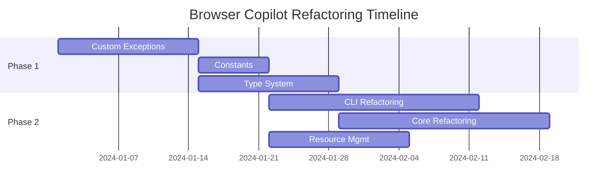

# Browser Copilot Refactoring Specifications

This directory contains detailed specifications for refactoring Browser Copilot following a specs-driven development approach. Each feature has its own directory with requirements, design, and tasks documents.

## 📋 Specification Structure

Each refactoring feature follows this structure:
```
feature-name/
├── requirements.md  # What needs to be done and why
├── design.md       # How it will be implemented
└── tasks.md        # Specific tasks and timeline
```

## 🚀 Refactoring Features

### Phase 1: Foundation (High Priority)

#### 1. [Custom Exceptions](./custom-exceptions/)
Implement domain-specific exception hierarchy with context and suggestions.
- **Goal**: Replace generic exceptions with meaningful errors
- **Impact**: Better debugging and user experience
- **Effort**: ~40 hours

#### 2. [Constants Extraction](./constants-extraction/)
Extract all magic numbers and strings into named constants.
- **Goal**: Improve readability and maintainability
- **Impact**: Single source of truth for values
- **Effort**: ~20 hours

#### 3. [Type System](./type-system/)
Define reusable type aliases and strengthen type safety.
- **Goal**: Reduce type duplication and improve IDE support
- **Impact**: Catch errors at development time
- **Effort**: ~30 hours

### Phase 2: Core Improvements (High Priority)

#### 4. [CLI Refactoring](./cli-refactoring/)
Break down 483-line function into modular components.
- **Goal**: Improve testability and maintainability
- **Impact**: 90% reduction in function complexity
- **Effort**: ~100 hours

#### 5. [Core Module Refactoring](./core-refactoring/)
Split BrowserPilot god object into focused components.
- **Goal**: Single responsibility principle
- **Impact**: Cleaner architecture
- **Effort**: ~80 hours

#### 6. [Resource Management](./resource-management/)
Implement context managers for proper cleanup.
- **Goal**: Fix Windows file lock issues
- **Impact**: Better cross-platform support
- **Effort**: ~40 hours

## 📊 Implementation Roadmap



## 🎯 Success Metrics

| Metric | Current | Target | Impact |
|--------|---------|--------|--------|
| Longest Function | 483 lines | < 50 lines | 90% reduction |
| Cyclomatic Complexity | ~25 | < 10 | 60% reduction |
| Test Coverage | ~70% | > 95% | 35% increase |
| Type Coverage | ~90% | 100% | Full type safety |
| Magic Numbers | 37+ | 0 | 100% elimination |

## 🔄 Development Process

1. **Review Specifications**
   - Read requirements to understand the "what" and "why"
   - Study design to understand the "how"
   - Review tasks for implementation plan

2. **Implementation**
   - Create feature branch: `refactor/feature-name`
   - Follow TDD: Write tests first
   - Implement incrementally
   - Ensure backward compatibility

3. **Quality Assurance**
   - Run full test suite
   - Check performance benchmarks
   - Verify no regressions
   - Update documentation

4. **Review and Merge**
   - Create PR with reference to spec
   - Code review by maintainers
   - Address feedback
   - Merge when approved

## 📝 Specification Template

When adding new refactoring specifications:

### requirements.md
- Overview and goals
- Functional requirements
- Non-functional requirements
- Constraints and dependencies
- Success criteria

### design.md
- Technical architecture
- Component design
- Integration approach
- Code examples
- Migration strategy

### tasks.md
- Task breakdown with estimates
- Dependencies between tasks
- Sprint planning
- Definition of done
- Risk mitigation

## 🤝 Contributing

1. Pick a feature to work on
2. Read all three documents for that feature
3. Create feature branch
4. Implement following the tasks
5. Submit PR referencing the spec

## ❓ Questions?

- Review existing specifications
- Open discussion in GitHub issues
- Tag maintainers for clarification

Remember: The goal is to improve code quality systematically while maintaining all existing functionality.