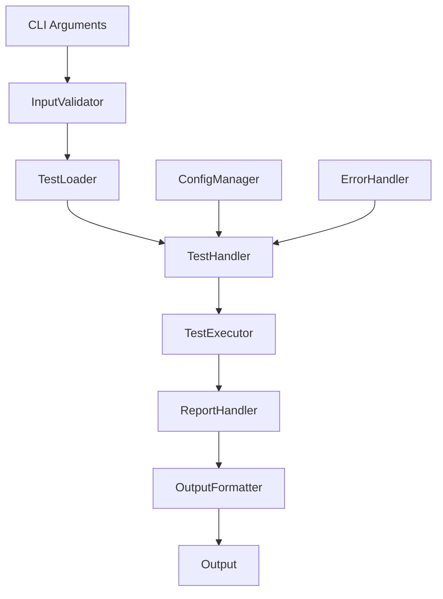

# CLI Refactoring - Design

## 1. Overview

This document describes the technical design for refactoring the CLI module, breaking down the monolithic `run_test_async` function into a modular, testable architecture.

## 2. Architecture

### 2.1 Component Architecture

```
cli/
├── __init__.py
├── main.py           # Entry point (minimal)
├── handlers/         # Request handlers
│   ├── __init__.py
│   └── test_handler.py
├── validators/       # Input validation
│   ├── __init__.py
│   └── input_validator.py
├── loaders/         # Content loading
│   ├── __init__.py
│   └── test_loader.py
├── executors/       # Test execution
│   ├── __init__.py
│   └── test_executor.py
├── reporters/       # Output generation
│   ├── __init__.py
│   └── report_handler.py
├── formatters/      # Output formatters
│   ├── __init__.py
│   ├── base.py
│   ├── json_formatter.py
│   ├── yaml_formatter.py
│   └── markdown_formatter.py
├── models/          # Data models
│   ├── __init__.py
│   └── cli_models.py
└── utils/           # CLI utilities
    ├── __init__.py
    └── cli_utils.py
```

### 2.2 Data Flow Design



### 2.3 Core Components

#### 2.3.1 Test Handler (Orchestrator)

```python
# browser_copilot/cli/handlers/test_handler.py

from dataclasses import dataclass
from typing import Optional
from ..models import ExecutionContext, TestResults
from ..validators import InputValidator
from ..loaders import TestLoader
from ..executors import TestExecutor
from ..reporters import ReportHandler

@dataclass
class TestHandler:
    """Orchestrates test execution workflow."""
    
    args: Namespace
    validator: InputValidator
    loader: TestLoader
    executor: TestExecutor
    reporter: ReportHandler
    
    @classmethod
    def from_args(cls, args: Namespace) -> "TestHandler":
        """Factory method to create handler from CLI args."""
        return cls(
            args=args,
            validator=InputValidator(),
            loader=TestLoader(),
            executor=TestExecutor.from_args(args),
            reporter=ReportHandler.from_args(args)
        )
    
    async def run(self) -> int:
        """Execute test workflow and return exit code."""
        try:
            # Step 1: Validate inputs
            validation_result = self.validator.validate_all(self.args)
            if not validation_result.is_valid:
                self._handle_validation_error(validation_result)
                return 1
            
            # Step 2: Load test content
            test_content = await self.loader.load(
                source=self.args.test_scenario,
                encoding=self.args.encoding
            )
            
            # Step 3: Create execution context
            context = self._create_context(validation_result)
            
            # Step 4: Execute test
            results = await self.executor.execute(test_content, context)
            
            # Step 5: Generate output
            await self.reporter.report(results, context)
            
            return 0 if results.success else 1
            
        except BrowserPilotError as e:
            self._handle_error(e)
            return 1
        except Exception as e:
            self._handle_unexpected_error(e)
            return 2
```

#### 2.3.2 Input Validator

```python
# browser_copilot/cli/validators/input_validator.py

from dataclasses import dataclass
from pathlib import Path
from typing import Optional, Any
from browser_copilot.types import BrowserType, OutputFormat

@dataclass
class ValidationResult:
    """Result of validation with errors and warnings."""
    is_valid: bool
    errors: list[str]
    warnings: list[str]
    validated_data: dict[str, Any]

class InputValidator:
    """Validates CLI inputs and arguments."""
    
    def validate_all(self, args: Namespace) -> ValidationResult:
        """Validate all CLI arguments."""
        errors = []
        warnings = []
        validated = {}
        
        # Validate test source
        if args.test_scenario != "-":
            path_result = self._validate_path(args.test_scenario)
            if path_result.error:
                errors.append(path_result.error)
            else:
                validated["test_path"] = path_result.value
        
        # Validate output format
        format_result = self._validate_output_format(args.output_format)
        if format_result.error:
            errors.append(format_result.error)
        else:
            validated["output_format"] = format_result.value
            
        # Validate browser
        browser_result = self._validate_browser(args.browser)
        if browser_result.error:
            errors.append(browser_result.error)
        else:
            validated["browser"] = browser_result.value
            
        # Validate viewport dimensions
        viewport_result = self._validate_viewport(
            args.viewport_width,
            args.viewport_height
        )
        if viewport_result.error:
            errors.append(viewport_result.error)
        else:
            validated.update(viewport_result.value)
            
        return ValidationResult(
            is_valid=len(errors) == 0,
            errors=errors,
            warnings=warnings,
            validated_data=validated
        )
    
    def _validate_path(self, path: str) -> ValidationItem:
        """Validate file path exists and is readable."""
        test_path = Path(path)
        
        if not test_path.exists():
            return ValidationItem(
                error=f"Test file not found: {path}",
                suggestion="Check the file path or use absolute path"
            )
            
        if not test_path.is_file():
            return ValidationItem(
                error=f"Path is not a file: {path}",
                suggestion="Provide a path to a test file, not a directory"
            )
            
        if not os.access(test_path, os.R_OK):
            return ValidationItem(
                error=f"Cannot read file: {path}",
                suggestion="Check file permissions"
            )
            
        return ValidationItem(value=test_path)
```

#### 2.3.3 Test Loader

```python
# browser_copilot/cli/loaders/test_loader.py

import aiofiles
from pathlib import Path
from typing import Optional
import sys

class TestLoader:
    """Loads test content from various sources."""
    
    async def load(
        self,
        source: str,
        encoding: str = "utf-8"
    ) -> str:
        """Load test content from source."""
        if source == "-":
            return await self._load_from_stdin()
        elif source.startswith("http://") or source.startswith("https://"):
            return await self._load_from_url(source)
        else:
            return await self._load_from_file(Path(source), encoding)
    
    async def _load_from_file(
        self,
        path: Path,
        encoding: str
    ) -> str:
        """Load test from file with async I/O."""
        try:
            async with aiofiles.open(path, "r", encoding=encoding) as f:
                content = await f.read()
                
            if not content.strip():
                raise TestParsingError(
                    "Test file is empty",
                    context={"path": str(path)},
                    suggestion="Add test steps to the file"
                )
                
            return content
            
        except UnicodeDecodeError as e:
            raise TestParsingError(
                "Failed to decode file content",
                context={"path": str(path), "encoding": encoding},
                suggestion=f"Try a different encoding (current: {encoding})"
            ) from e
            
    async def _load_from_stdin(self) -> str:
        """Load test content from stdin."""
        content = sys.stdin.read()
        
        if not content.strip():
            raise TestParsingError(
                "No test content provided on stdin",
                suggestion="Pipe test content to the command"
            )
            
        return content
```

#### 2.3.4 Test Executor

```python
# browser_copilot/cli/executors/test_executor.py

from browser_copilot.core import BrowserPilot
from ..models import ExecutionContext, TestResults

class TestExecutor:
    """Manages test execution with the browser pilot."""
    
    def __init__(self, config: ExecutorConfig):
        self.config = config
        self.token_tracker = TokenTracker()
        self.telemetry = TelemetryManager()
        
    async def execute(
        self,
        test_content: str,
        context: ExecutionContext
    ) -> TestResults:
        """Execute test and return results."""
        pilot = None
        start_time = time.time()
        
        try:
            # Create browser pilot
            pilot = await self._create_pilot(context)
            
            # Execute with retries
            for attempt in range(context.retry_count):
                try:
                    result = await self._execute_once(
                        pilot,
                        test_content,
                        context
                    )
                    
                    if result.success or attempt == context.retry_count - 1:
                        return result
                        
                    await asyncio.sleep(2 ** attempt)  # Exponential backoff
                    
                except TimeoutError as e:
                    if attempt == context.retry_count - 1:
                        raise
                        
        finally:
            if pilot:
                pilot.close()
                
    async def _execute_once(
        self,
        pilot: BrowserPilot,
        test_content: str,
        context: ExecutionContext
    ) -> TestResults:
        """Single execution attempt."""
        result = await pilot.run_test_suite(test_content)
        
        return TestResults(
            success=result["success"],
            duration=result["duration"],
            steps_executed=result["steps_executed"],
            token_usage=self.token_tracker.get_usage(),
            cost_estimate=self.telemetry.calculate_cost(),
            optimization_stats=result.get("optimization_stats", {}),
            report_content=result["report"],
            screenshots=result.get("screenshots", []),
            error=result.get("error")
        )
```

#### 2.3.5 Report Handler

```python
# browser_copilot/cli/reporters/report_handler.py

from typing import Optional
from pathlib import Path
from ..formatters import FormatterFactory
from ..models import TestResults, ExecutionContext

class ReportHandler:
    """Handles report generation and output."""
    
    def __init__(self, config: ReporterConfig):
        self.config = config
        self.formatter_factory = FormatterFactory()
        
    async def report(
        self,
        results: TestResults,
        context: ExecutionContext
    ) -> None:
        """Generate and output report."""
        # Get appropriate formatter
        formatter = self.formatter_factory.get_formatter(
            context.output_format
        )
        
        # Format results
        formatted = formatter.format(results)
        
        # Output to file or stdout
        if context.output_file:
            await self._write_to_file(formatted, context.output_file)
        else:
            self._write_to_stdout(formatted)
            
        # Save additional artifacts if requested
        if not context.no_artifacts:
            await self._save_artifacts(results, context)
```

### 2.4 Error Handling Strategy

```python
class CLIErrorHandler:
    """Centralized error handling for CLI."""
    
    def handle_error(self, error: Exception) -> int:
        """Handle error and return exit code."""
        if isinstance(error, ValidationError):
            self._print_validation_error(error)
            return 1
        elif isinstance(error, TestExecutionError):
            self._print_execution_error(error)
            return 1
        elif isinstance(error, BrowserPilotError):
            self._print_general_error(error)
            return 1
        else:
            self._print_unexpected_error(error)
            return 2
```

## 3. Testing Strategy

### 3.1 Unit Testing

Each component is independently testable:

```python
# tests/cli/test_validator.py
def test_validate_browser_valid():
    validator = InputValidator()
    result = validator._validate_browser("chromium")
    assert result.error is None
    assert result.value == "chromium"

def test_validate_browser_invalid():
    validator = InputValidator()
    result = validator._validate_browser("netscape")
    assert result.error is not None
    assert "not supported" in result.error
```

### 3.2 Integration Testing

```python
# tests/cli/test_integration.py
async def test_cli_workflow():
    """Test complete CLI workflow."""
    args = create_test_args(
        test_scenario="test.md",
        output_format="json"
    )
    
    handler = TestHandler.from_args(args)
    exit_code = await handler.run()
    
    assert exit_code == 0
```

## 4. Performance Considerations

- Lazy loading of components
- Async I/O for file operations
- Streaming for large outputs
- Connection pooling for retries

## 5. Migration Plan

### Phase 1: Create New Structure
- Create cli package
- Implement new components
- Add comprehensive tests

### Phase 2: Integration
- Update main entry point
- Route to new handler
- Feature flag for rollback

### Phase 3: Cleanup
- Remove old code
- Update imports
- Final testing