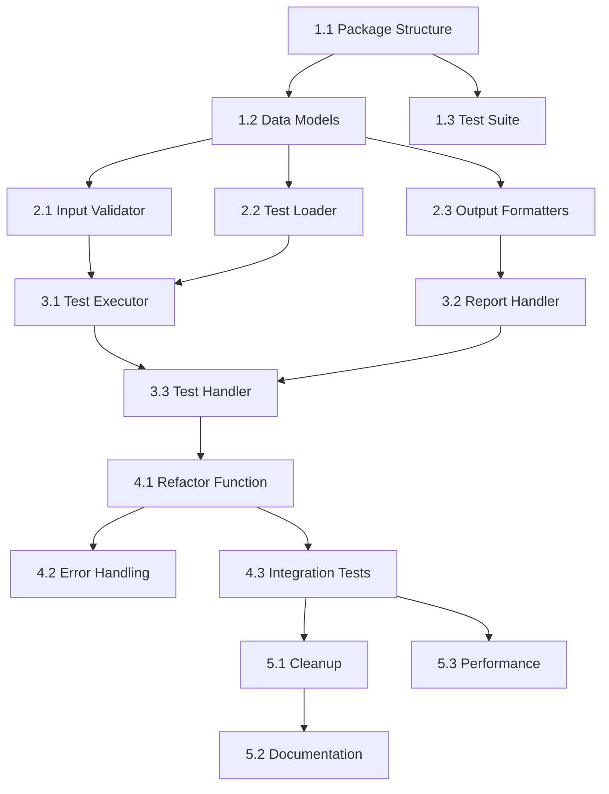

# CLI Refactoring - Tasks

## 1. Overview

This document breaks down the CLI refactoring into specific tasks with clear deliverables, dependencies, and acceptance criteria.

## 2. Task Breakdown

### Phase 1: Setup and Structure (Sprint 1)

#### Task 1.1: Create CLI Package Structure
**Priority**: P0  
**Estimate**: 2 hours  
**Assignee**: TBD

- [ ] Create `browser_copilot/cli/` directory
- [ ] Create subdirectories: `handlers/`, `validators/`, `loaders/`, `executors/`, `reporters/`, `formatters/`, `models/`, `utils/`
- [ ] Add `__init__.py` files to all directories
- [ ] Update imports in main `cli.py`

**Acceptance Criteria**:
- Package structure created
- All imports working
- No circular dependencies

#### Task 1.2: Define Data Models
**Priority**: P0  
**Estimate**: 3 hours  
**Dependencies**: Task 1.1

- [ ] Create `cli/models/cli_models.py`
- [ ] Define `ExecutionContext` dataclass
- [ ] Define `TestResults` dataclass
- [ ] Define `ValidationResult` dataclass
- [ ] Add type hints and documentation

**Acceptance Criteria**:
- All models properly typed
- Serialization methods implemented
- 100% test coverage

#### Task 1.3: Create Base Test Suite
**Priority**: P0  
**Estimate**: 4 hours  
**Dependencies**: Task 1.1

- [ ] Create test structure mirroring CLI package
- [ ] Set up test fixtures
- [ ] Create test data files
- [ ] Implement test utilities

**Acceptance Criteria**:
- Test structure matches code structure
- Fixtures cover common scenarios
- Tests run successfully

### Phase 2: Core Components (Sprint 1-2)

#### Task 2.1: Implement Input Validator
**Priority**: P0  
**Estimate**: 6 hours  
**Dependencies**: Task 1.2

- [ ] Create `InputValidator` class
- [ ] Implement `validate_all()` method
- [ ] Add individual validation methods:
  - [ ] `_validate_path()`
  - [ ] `_validate_output_format()`
  - [ ] `_validate_browser()`
  - [ ] `_validate_viewport()`
  - [ ] `_validate_timeout()`
- [ ] Write comprehensive tests

**Acceptance Criteria**:
- All inputs validated
- Clear error messages
- Helpful suggestions
- 100% test coverage

#### Task 2.2: Implement Test Loader
**Priority**: P0  
**Estimate**: 5 hours  
**Dependencies**: Task 1.2

- [ ] Create `TestLoader` class
- [ ] Implement loading methods:
  - [ ] `_load_from_file()`
  - [ ] `_load_from_stdin()`
  - [ ] `_load_from_url()` (stub for future)
- [ ] Add encoding support
- [ ] Handle large files efficiently
- [ ] Write tests for all scenarios

**Acceptance Criteria**:
- All input sources working
- Encoding issues handled
- Large files supported
- Error handling comprehensive

#### Task 2.3: Extract Output Formatters
**Priority**: P1  
**Estimate**: 8 hours  
**Dependencies**: Task 1.2

- [ ] Create base `OutputFormatter` class
- [ ] Implement formatters:
  - [ ] `JsonFormatter`
  - [ ] `YamlFormatter`
  - [ ] `MarkdownFormatter`
  - [ ] `HtmlFormatter`
  - [ ] `XmlFormatter`
  - [ ] `JunitFormatter`
- [ ] Create `FormatterFactory`
- [ ] Write tests for each formatter

**Acceptance Criteria**:
- All formats preserved
- Output identical to current
- Easy to add new formats
- Memory efficient

### Phase 3: Execution Components (Sprint 2)

#### Task 3.1: Implement Test Executor
**Priority**: P0  
**Estimate**: 8 hours  
**Dependencies**: Task 2.1, 2.2

- [ ] Create `TestExecutor` class
- [ ] Implement execution flow:
  - [ ] `_create_pilot()`
  - [ ] `_execute_once()`
  - [ ] `_handle_retry()`
- [ ] Add timeout handling
- [ ] Implement token tracking
- [ ] Write comprehensive tests

**Acceptance Criteria**:
- Clean execution flow
- Proper retry logic
- Resource cleanup guaranteed
- Token tracking accurate

#### Task 3.2: Implement Report Handler
**Priority**: P1  
**Estimate**: 6 hours  
**Dependencies**: Task 2.3

- [ ] Create `ReportHandler` class
- [ ] Implement report generation
- [ ] Add file writing logic
- [ ] Handle stdout output
- [ ] Save artifacts (screenshots, logs)
- [ ] Write tests

**Acceptance Criteria**:
- Reports generated correctly
- File output working
- Artifacts saved properly
- Memory efficient

#### Task 3.3: Create Test Handler
**Priority**: P0  
**Estimate**: 6 hours  
**Dependencies**: Tasks 2.1, 2.2, 3.1, 3.2

- [ ] Create `TestHandler` class
- [ ] Implement orchestration logic
- [ ] Add error handling
- [ ] Implement factory method
- [ ] Write integration tests

**Acceptance Criteria**:
- Clean orchestration
- All components integrated
- Error handling comprehensive
- Exit codes correct

### Phase 4: Integration (Sprint 2-3)

#### Task 4.1: Refactor run_test_async
**Priority**: P0  
**Estimate**: 4 hours  
**Dependencies**: Phase 3 complete

- [ ] Create minimal `run_test_async`
- [ ] Delegate to `TestHandler`
- [ ] Preserve backward compatibility
- [ ] Add feature flag if needed

**Acceptance Criteria**:
- Function < 50 lines
- All tests still pass
- No behavior changes
- Performance maintained

#### Task 4.2: Update Error Handling
**Priority**: P1  
**Estimate**: 4 hours  
**Dependencies**: Task 4.1

- [ ] Integrate with custom exceptions
- [ ] Update error messages
- [ ] Add context to errors
- [ ] Test error paths

**Acceptance Criteria**:
- Better error messages
- Context included
- Suggestions provided
- All paths tested

#### Task 4.3: Integration Testing
**Priority**: P0  
**Estimate**: 6 hours  
**Dependencies**: Task 4.1, 4.2

- [ ] Create end-to-end tests
- [ ] Test all CLI options
- [ ] Verify output formats
- [ ] Performance benchmarks
- [ ] Memory profiling

**Acceptance Criteria**:
- All workflows tested
- No regressions
- Performance acceptable
- Memory usage stable

### Phase 5: Cleanup and Documentation (Sprint 3)

#### Task 5.1: Remove Old Code
**Priority**: P1  
**Estimate**: 3 hours  
**Dependencies**: Phase 4 complete

- [ ] Remove old implementation
- [ ] Clean up imports
- [ ] Remove dead code
- [ ] Update references

**Acceptance Criteria**:
- Old code removed
- All imports updated
- No dead code
- Tests still pass

#### Task 5.2: Update Documentation
**Priority**: P2  
**Estimate**: 4 hours  
**Dependencies**: Task 5.1

- [ ] Update architecture docs
- [ ] Document new structure
- [ ] Add developer guide
- [ ] Update API documentation

**Acceptance Criteria**:
- Docs reflect new structure
- Examples updated
- Developer guide complete
- API docs accurate

#### Task 5.3: Performance Optimization
**Priority**: P2  
**Estimate**: 4 hours  
**Dependencies**: Phase 4 complete

- [ ] Profile hot paths
- [ ] Optimize slow operations
- [ ] Add caching where beneficial
- [ ] Verify improvements

**Acceptance Criteria**:
- No performance regression
- Startup time < 500ms
- Memory usage stable
- Benchmarks documented

## 3. Task Dependencies

## 4. Definition of Done

A task is complete when:
- [ ] Code implemented and working
- [ ] Unit tests written and passing
- [ ] Test coverage > 95%
- [ ] Code reviewed and approved
- [ ] Documentation updated
- [ ] No performance regression
- [ ] Integration tests pass

## 5. Risk Mitigation

### Risk: Breaking backward compatibility
**Mitigation**: 
- Extensive integration tests
- Feature flags for rollback
- Gradual rollout

### Risk: Performance degradation
**Mitigation**:
- Benchmark before/after
- Profile critical paths
- Optimize as needed

### Risk: Complex migration
**Mitigation**:
- Small incremental changes
- Keep old code temporarily
- Thorough testing

## 6. Estimated Timeline

- **Sprint 1** (Week 1-2): Phase 1 & 2
- **Sprint 2** (Week 3-4): Phase 3 & 4
- **Sprint 3** (Week 5-6): Phase 5 & stabilization

Total estimated effort: ~100 hours