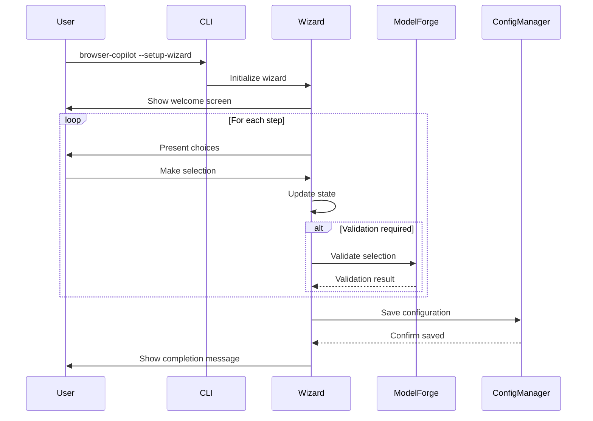

# Browser Copilot Configuration Wizard Design

**Date**: January 28, 2025
**Version**: 1.0
**Status**: Draft

## Overview

This document describes the technical design for the Browser Copilot Configuration Wizard, an interactive CLI tool that guides users through initial setup and configuration.

## Architecture

### Component Overview

```
┌─────────────────────────────────────────────────────────────┐
│                     CLI Entry Point                         │
│                  (browser_copilot/cli.py)                     │
└─────────────────────┬───────────────────────────────────────┘
                      │
                      ▼
┌─────────────────────────────────────────────────────────────┐
│                  Configuration Wizard                        │
│             (browser_copilot/config_wizard.py)                │
├─────────────────────────────────────────────────────────────┤
│ • WizardFlow (Main orchestrator)                           │
│ • WizardState (State management)                           │
│ • StepHandlers (Individual step logic)                     │
└──────┬────────────┬────────────┬────────────┬──────────────┘
       │            │            │            │
       ▼            ▼            ▼            ▼
┌──────────┐ ┌──────────┐ ┌──────────┐ ┌──────────┐
│Questionary│ │ModelForge│ │  Config  │ │Playwright│
│   UI      │ │Registry  │ │ Manager  │ │  Test    │
└──────────┘ └──────────┘ └──────────┘ └──────────┘
```

### Key Components

#### 1. WizardFlow Class
Main orchestrator that manages the flow between steps.

```python
class WizardFlow:
    def __init__(self):
        self.state = WizardState()
        self.steps = [
            WelcomeStep(),
            ProviderSelectionStep(),
            ModelSelectionStep(),
            AuthenticationStep(),
            BrowserSelectionStep(),
            TestModeStep(),
            TokenOptimizationStep(),
            ValidationStep(),
            SaveConfigurationStep(),
            CompletionStep()
        ]
    
    async def run(self) -> WizardResult:
        """Execute the wizard flow"""
        for step in self.steps:
            result = await step.execute(self.state)
            if result.action == WizardAction.CANCEL:
                return self._handle_cancel()
            elif result.action == WizardAction.BACK:
                return self._handle_back()
            self.state.update(result.data)
        return WizardResult(success=True, config=self.state.to_config())
```

#### 2. WizardState Class
Manages the state throughout the wizard execution.

```python
@dataclass
class WizardState:
    provider: Optional[str] = None
    model: Optional[str] = None
    api_key: Optional[str] = None
    browser: str = "chromium"
    headless: bool = True
    compression_level: str = "medium"
    viewport_width: int = 1920
    viewport_height: int = 1080
    
    # Navigation state
    current_step: int = 0
    history: List[Dict[str, Any]] = field(default_factory=list)
    
    # Validation results
    provider_validated: bool = False
    browser_validated: bool = False
    
    def to_config(self) -> Dict[str, Any]:
        """Convert state to configuration format"""
        return {
            "provider": self.provider,
            "model": self.model,
            "browser": self.browser,
            "headless": self.headless,
            "compression_level": self.compression_level,
            "viewport": {
                "width": self.viewport_width,
                "height": self.viewport_height
            }
        }
```

#### 3. Step Interface
Base interface for all wizard steps.

```python
from abc import ABC, abstractmethod
from enum import Enum

class WizardAction(Enum):
    CONTINUE = "continue"
    BACK = "back"
    CANCEL = "cancel"
    RETRY = "retry"

@dataclass
class StepResult:
    action: WizardAction
    data: Dict[str, Any]
    error: Optional[str] = None

class WizardStep(ABC):
    @abstractmethod
    async def execute(self, state: WizardState) -> StepResult:
        """Execute this wizard step"""
        pass
    
    @abstractmethod
    def can_skip(self, state: WizardState) -> bool:
        """Check if this step can be skipped"""
        pass
```

#### 4. Provider Selection Step
Handles LLM provider selection with GitHub Copilot prioritized.

```python
class ProviderSelectionStep(WizardStep):
    async def execute(self, state: WizardState) -> StepResult:
        # Get available providers from ModelForge
        registry = ModelForgeRegistry()
        providers = await registry.get_providers()
        
        # Sort with GitHub Copilot first
        sorted_providers = self._sort_providers(providers)
        
        # Create choices for Questionary
        choices = []
        for provider in sorted_providers:
            label = f"{provider.name:<20}"
            if provider.name == "github_copilot":
                label += " (Recommended - No API key needed!)"
            elif provider.requires_api_key:
                label += " (Requires API key)"
            choices.append(Choice(title=label, value=provider.name))
        
        # Show selection prompt
        selected = await questionary.select(
            "Select your LLM provider:",
            choices=choices,
            use_shortcuts=True,
            use_arrow_keys=True
        ).unsafe_ask_async()
        
        return StepResult(
            action=WizardAction.CONTINUE,
            data={"provider": selected}
        )
```

#### 5. GitHub Copilot Authentication
Special handling for GitHub Copilot device flow.

```python
class GitHubCopilotAuth:
    async def authenticate(self) -> AuthResult:
        # Initialize device flow
        device_code_response = await self._request_device_code()
        
        # Display instructions
        print(f"\n🔐 GitHub Copilot requires authentication.\n")
        print(f"1. Go to: {device_code_response.verification_uri}")
        print(f"2. Enter code: {device_code_response.user_code}")
        print(f"3. Authorize the application\n")
        
        # Poll for completion
        spinner = Spinner("Waiting for authorization")
        spinner.start()
        
        try:
            token = await self._poll_for_token(
                device_code_response.device_code,
                device_code_response.interval
            )
            spinner.stop()
            print("✅ Authentication successful!")
            return AuthResult(success=True, token=token)
        except AuthError as e:
            spinner.stop()
            print(f"❌ Authentication failed: {e}")
            return AuthResult(success=False, error=str(e))
```

### Data Flow



### Error Handling

#### Graceful Degradation
- If ModelForge is unavailable, fall back to manual entry
- If authentication fails, offer retry or skip options
- If validation fails, provide clear error messages with solutions

#### Recovery Points
- State is preserved between steps
- Users can go back to previous steps
- Partial progress can be saved

```python
class ErrorHandler:
    @staticmethod
    def handle_provider_error(error: Exception) -> StepResult:
        if isinstance(error, NetworkError):
            choices = [
                "Retry connection",
                "Enter provider manually",
                "Use offline mode"
            ]
        elif isinstance(error, AuthenticationError):
            choices = [
                "Enter API key now",
                "Choose different provider",
                "Skip validation"
            ]
        
        action = questionary.select(
            f"Error: {error}\n\nWhat would you like to do?",
            choices=choices
        ).ask()
        
        return StepResult(
            action=WizardAction.RETRY if "Retry" in action else WizardAction.CONTINUE,
            data={"manual_mode": True}
        )
```

### UI Components

#### Progress Indicator
Shows current position in wizard flow.

```
━━━━━━━━━━━━━━━━━━━━━━━━━━━━━━━━━━━━━━━━
Step 3 of 10: Model Selection
━━━━━━━━━━━━━━━━━━━━━━━━━━━━━━━━━━━━━━━━
```

#### Keyboard Navigation
- **↑/↓**: Navigate choices
- **Enter**: Select current choice
- **Tab**: Accept default
- **Esc**: Cancel (with confirmation)
- **Ctrl+C**: Exit (with confirmation)

#### Styling
Using Questionary's built-in styling with custom theme:

```python
custom_style = Style([
    ('qmark', 'fg:#0084ff bold'),        # Question mark
    ('question', 'bold'),                 # Question text
    ('answer', 'fg:#44ff44 bold'),       # Selected answer
    ('pointer', 'fg:#0084ff bold'),      # Selection pointer
    ('highlighted', 'fg:#0084ff bold'),  # Highlighted choice
    ('selected', 'fg:#44ff44'),          # Selected item
    ('separator', 'fg:#808080'),         # Separators
    ('instruction', 'fg:#808080'),       # Instructions
    ('text', ''),                        # Normal text
    ('disabled', 'fg:#808080 italic'),  # Disabled choices
])
```

### Integration Points

#### 1. CLI Integration
Add wizard entry point to existing CLI:

```python
# In browser_copilot/cli.py
parser.add_argument(
    "--setup-wizard",
    action="store_true",
    help="Launch interactive configuration wizard"
)

# Check on first run
if not config_exists() and not args.setup_wizard:
    if questionary.confirm("No configuration found. Run setup wizard?").ask():
        run_wizard()
```

#### 2. ModelForge Integration
Use existing ModelForge registry for dynamic discovery:

```python
from modelforge.registry import ModelForgeRegistry

async def get_available_providers():
    registry = ModelForgeRegistry()
    providers = await registry.discover_providers()
    
    # Filter and enhance
    return [
        {
            "name": p.name,
            "display_name": p.display_name,
            "requires_api_key": p.auth_type == "api_key",
            "models": await registry.get_models(p.name)
        }
        for p in providers
        if p.status == "available"
    ]
```

#### 3. Configuration Storage
Save to standard Browser Copilot configuration:

```python
class ConfigurationSaver:
    def save(self, config: Dict[str, Any], backup: bool = True):
        config_path = get_config_path()
        
        # Backup existing config
        if backup and config_path.exists():
            backup_path = config_path.with_suffix('.backup')
            shutil.copy(config_path, backup_path)
        
        # Save new config
        with open(config_path, 'w') as f:
            json.dump(config, f, indent=2)
        
        # Set appropriate permissions
        os.chmod(config_path, 0o600)  # Read/write for owner only
```

### Testing Strategy

#### Unit Tests
- Test each step in isolation
- Mock external dependencies (ModelForge, filesystem)
- Test error handling paths

#### Integration Tests
- Test full wizard flow
- Test with real ModelForge integration
- Test configuration persistence

#### User Acceptance Tests
- Test with QA engineers unfamiliar with the tool
- Measure time to complete setup
- Collect feedback on clarity and ease of use

### Performance Considerations

#### Responsiveness
- All UI operations < 100ms
- Provider/model discovery cached after first load
- Async operations for network calls

#### Resource Usage
- Minimal memory footprint
- No persistent background processes
- Clean up temporary files

### Security Considerations

#### Credential Handling
- Never log API keys or tokens
- Use secure storage for sensitive data
- Clear credentials from memory after use

#### File Permissions
- Configuration files: 0600 (owner read/write only)
- Log files: 0644 (owner write, others read)
- No world-writable directories

### Future Enhancements

1. **Profile Support**
   - Multiple named configurations
   - Quick switching between profiles
   - Team/project specific settings

2. **Import/Export**
   - Import from other tools
   - Export configuration for sharing
   - Configuration templates

3. **Advanced Mode**
   - Additional options for power users
   - Proxy configuration
   - Custom endpoints

4. **Validation Improvements**
   - Test specific model capabilities
   - Estimate costs based on usage
   - Network connectivity tests

## Implementation Timeline

**Phase 1** (Core Wizard - 2 days)
- Basic wizard flow
- Provider/model selection
- Simple configuration save

**Phase 2** (Authentication - 1 day)
- GitHub Copilot device flow
- API key entry
- Validation

**Phase 3** (Polish - 1 day)
- Error handling
- Progress indicators
- Help text

**Phase 4** (Testing - 1 day)
- Unit tests
- Integration tests
- Documentation

Total estimate: 5 days