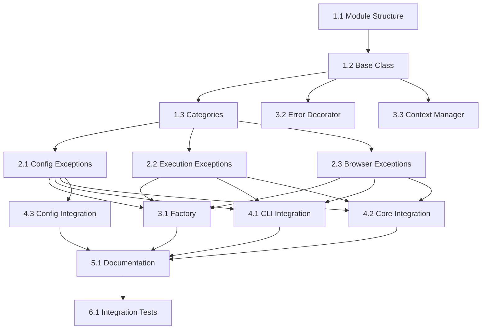

# Custom Exceptions - Tasks

## 1. Overview

This document breaks down the implementation of custom exceptions into specific, actionable tasks with clear dependencies and acceptance criteria.

## 2. Task Breakdown

### Phase 1: Foundation (Sprint 1)

#### Task 1.1: Create Exception Module Structure
**Priority**: P0  
**Estimate**: 2 hours  
**Assignee**: TBD

- [ ] Create `browser_copilot/exceptions.py`
- [ ] Create `tests/test_exceptions.py`
- [ ] Add exceptions module to `__init__.py` exports
- [ ] Create basic project structure

**Acceptance Criteria**:
- Module imports successfully
- Basic test file runs
- No circular import issues

#### Task 1.2: Implement Base Exception Class
**Priority**: P0  
**Estimate**: 4 hours  
**Dependencies**: Task 1.1

- [ ] Implement `BrowserPilotError` class
- [ ] Add context dictionary support
- [ ] Add suggestion field
- [ ] Implement `to_dict()` and `to_json()` methods
- [ ] Add automatic context collection
- [ ] Write comprehensive tests

**Acceptance Criteria**:
- All tests pass
- 100% code coverage
- Context properly serialized
- No performance regression

#### Task 1.3: Define Exception Categories
**Priority**: P0  
**Estimate**: 3 hours  
**Dependencies**: Task 1.2

- [ ] Create `ConfigurationError` class
- [ ] Create `ExecutionError` class
- [ ] Create `BrowserError` class
- [ ] Create `ValidationError` class
- [ ] Create `ResourceError` class
- [ ] Create `AuthenticationError` class
- [ ] Add tests for each category

**Acceptance Criteria**:
- All exception classes properly inherit from base
- Each has appropriate docstring
- Tests verify inheritance chain

### Phase 2: Specific Exceptions (Sprint 1-2)

#### Task 2.1: Implement Configuration Exceptions
**Priority**: P1  
**Estimate**: 3 hours  
**Dependencies**: Task 1.3

- [ ] Create `MissingConfigError`
- [ ] Create `InvalidConfigError`
- [ ] Create `ProviderConfigError`
- [ ] Add specific context fields
- [ ] Write tests with examples

**Acceptance Criteria**:
- Each exception has clear use case
- Context includes config keys
- Suggestions for common fixes

#### Task 2.2: Implement Execution Exceptions
**Priority**: P1  
**Estimate**: 3 hours  
**Dependencies**: Task 1.3

- [ ] Create `TestExecutionError`
- [ ] Create `StepExecutionError`
- [ ] Create `TimeoutError`
- [ ] Add test file and step context
- [ ] Include duration in timeout errors

**Acceptance Criteria**:
- Step number included in context
- Test file path included
- Timeout includes limit and actual time

#### Task 2.3: Implement Browser Exceptions
**Priority**: P1  
**Estimate**: 3 hours  
**Dependencies**: Task 1.3

- [ ] Create `BrowserInitError`
- [ ] Create `BrowserOperationError`
- [ ] Create `MCPConnectionError`
- [ ] Add browser type to context
- [ ] Include MCP path information

**Acceptance Criteria**:
- Browser type always in context
- MCP errors include troubleshooting steps
- Operation errors include action type

### Phase 3: Helper Utilities (Sprint 2)

#### Task 3.1: Create Exception Factory
**Priority**: P2  
**Estimate**: 4 hours  
**Dependencies**: Phase 2 tasks

- [ ] Create `ExceptionFactory` class
- [ ] Add common error creators
- [ ] Include parameter validation
- [ ] Add comprehensive tests
- [ ] Document usage patterns

**Acceptance Criteria**:
- Factory methods for 10+ common errors
- Consistent error messages
- Type hints on all methods

#### Task 3.2: Implement Error Handler Decorator
**Priority**: P2  
**Estimate**: 4 hours  
**Dependencies**: Task 1.2

- [ ] Create `handle_errors` decorator
- [ ] Support both sync and async functions
- [ ] Add exception wrapping option
- [ ] Include context injection
- [ ] Write tests for edge cases

**Acceptance Criteria**:
- Works with async functions
- Preserves function signatures
- Original exception in chain

#### Task 3.3: Create Context Manager
**Priority**: P2  
**Estimate**: 3 hours  
**Dependencies**: Task 1.2

- [ ] Create `error_context` context manager
- [ ] Support nested contexts
- [ ] Add automatic context merging
- [ ] Write comprehensive tests

**Acceptance Criteria**:
- Context properly added to exceptions
- Nested contexts merge correctly
- No memory leaks

### Phase 4: Integration (Sprint 2-3)

#### Task 4.1: Update CLI Module
**Priority**: P1  
**Estimate**: 6 hours  
**Dependencies**: Phase 2 complete

- [ ] Replace ValueError with ValidationError
- [ ] Add context to all exceptions
- [ ] Include suggestions for user errors
- [ ] Update tests
- [ ] Verify no breaking changes

**Files to update**:
- `browser_copilot/cli.py`
- `tests/test_cli.py`

**Acceptance Criteria**:
- All generic exceptions replaced
- Tests still pass
- Better error messages

#### Task 4.2: Update Core Module
**Priority**: P1  
**Estimate**: 6 hours  
**Dependencies**: Phase 2 complete

- [ ] Replace generic exceptions
- [ ] Add browser context to errors
- [ ] Include execution context
- [ ] Update all error paths
- [ ] Maintain compatibility

**Files to update**:
- `browser_copilot/core.py`
- `tests/test_core.py`

**Acceptance Criteria**:
- Improved error diagnostics
- No functionality changes
- All tests pass

#### Task 4.3: Update Config Manager
**Priority**: P1  
**Estimate**: 4 hours  
**Dependencies**: Task 2.1

- [ ] Use ConfigurationError types
- [ ] Add config path context
- [ ] Include validation details
- [ ] Update error messages

**Files to update**:
- `browser_copilot/config_manager.py`
- `tests/test_config_manager.py`

### Phase 5: Documentation (Sprint 3)

#### Task 5.1: Create Exception Reference
**Priority**: P2  
**Estimate**: 4 hours  
**Dependencies**: Phase 1-3 complete

- [ ] Document all exception types
- [ ] Include usage examples
- [ ] Add troubleshooting guide
- [ ] Create migration guide

**Deliverables**:
- `docs/exceptions.md`
- `docs/troubleshooting.md`
- `docs/migration/exceptions.md`

#### Task 5.2: Update Contributing Guide
**Priority**: P3  
**Estimate**: 2 hours  
**Dependencies**: Task 5.1

- [ ] Add exception guidelines
- [ ] Include examples
- [ ] Define when to create new exceptions
- [ ] Add testing requirements

### Phase 6: Testing & Validation (Sprint 3)

#### Task 6.1: Integration Testing
**Priority**: P1  
**Estimate**: 6 hours  
**Dependencies**: Phase 4 complete

- [ ] Test exception flow end-to-end
- [ ] Verify error messages reach users
- [ ] Check logging integration
- [ ] Test error recovery paths

#### Task 6.2: Performance Testing
**Priority**: P2  
**Estimate**: 3 hours  
**Dependencies**: Phase 4 complete

- [ ] Benchmark exception creation
- [ ] Test context serialization speed
- [ ] Check memory usage
- [ ] Verify no regression

## 3. Task Dependencies

## 4. Sprint Planning

### Sprint 1 (Week 1-2)
- Phase 1: Foundation (Tasks 1.1-1.3)
- Phase 2: Specific Exceptions (Tasks 2.1-2.3)
- **Deliverable**: Exception module with all types

### Sprint 2 (Week 3-4)
- Phase 3: Helper Utilities (Tasks 3.1-3.3)
- Phase 4: Begin Integration (Tasks 4.1-4.2)
- **Deliverable**: Integrated exceptions in core modules

### Sprint 3 (Week 5-6)
- Phase 4: Complete Integration (Task 4.3)
- Phase 5: Documentation (Tasks 5.1-5.2)
- Phase 6: Testing (Tasks 6.1-6.2)
- **Deliverable**: Fully integrated and documented

## 5. Success Metrics

- **Code Coverage**: 100% on exception module
- **Integration**: 100% of generic exceptions replaced
- **Performance**: < 1ms exception creation time
- **Documentation**: All exceptions documented
- **Testing**: Zero regression bugs

## 6. Risk Mitigation

### Risk: Breaking Changes
**Mitigation**: 
- Gradual rollout
- Compatibility layer
- Comprehensive testing

### Risk: Performance Impact
**Mitigation**:
- Benchmark before/after
- Lazy context evaluation
- Profile hot paths

## 7. Definition of Done

A task is complete when:
- [ ] Code implemented and tested
- [ ] Tests pass with 100% coverage
- [ ] Documentation updated
- [ ] Code reviewed and approved
- [ ] No performance regression
- [ ] Integration tests pass