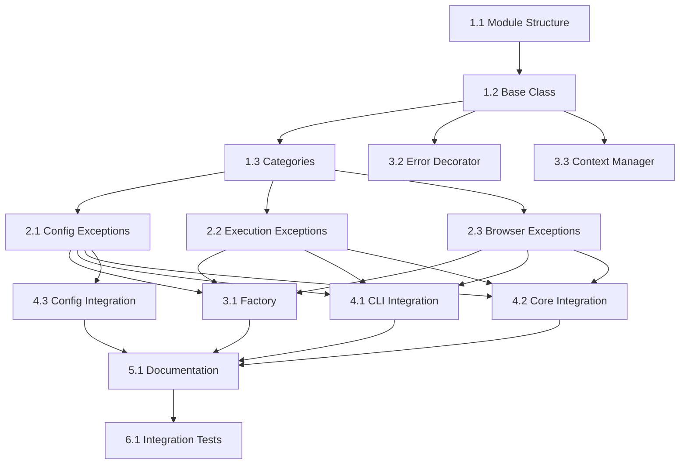

# Custom Exceptions - Tasks

**Last Updated**: July 30, 2025
**Overall Progress**: 15% Complete

## 1. Overview

This document breaks down the implementation of custom exceptions into specific, actionable tasks with clear dependencies and acceptance criteria.

**Current Status**: Basic exception hierarchy exists in `browser_copilot/components/exceptions.py` but lacks advanced features like context, suggestions, and comprehensive integration.

## 2. Task Breakdown

### Phase 1: Foundation (Sprint 1)

#### Task 1.1: Create Exception Module Structure ⚠️ PARTIALLY COMPLETE
**Priority**: P0
**Estimate**: 2 hours
**Actual**: 1 hour
**Assignee**: TBD

- [x] ~~Create `browser_copilot/exceptions.py`~~ Created as `components/exceptions.py`
- [ ] Create `tests/test_exceptions.py`
- [x] Add exceptions module to `__init__.py` exports (in components)
- [x] Create basic project structure

**Acceptance Criteria**:
- Module imports successfully
- Basic test file runs
- No circular import issues

#### Task 1.2: Implement Base Exception Class ⚠️ MINIMAL IMPLEMENTATION
**Priority**: P0
**Estimate**: 4 hours
**Actual**: 0.5 hours
**Dependencies**: Task 1.1

- [x] Implement `BrowserPilotError` class (basic version)
- [ ] Add context dictionary support
- [ ] Add suggestion field
- [ ] Implement `to_dict()` and `to_json()` methods
- [ ] Add automatic context collection
- [ ] Write comprehensive tests

**Acceptance Criteria**:
- All tests pass
- 100% code coverage
- Context properly serialized
- No performance regression

#### Task 1.3: Define Exception Categories ⚠️ PARTIALLY COMPLETE
**Priority**: P0
**Estimate**: 3 hours
**Actual**: 1 hour
**Dependencies**: Task 1.2

- [x] Create `ConfigurationError` class
- [x] Create `ExecutionError` class
- [x] ~~Create `BrowserError` class~~ Created as `BrowserSetupError`
- [ ] Create `ValidationError` class
- [ ] Create `ResourceError` class
- [ ] Create `AuthenticationError` class
- [x] Create `AnalysisError` class (additional)
- [ ] Add tests for each category

**Acceptance Criteria**:
- All exception classes properly inherit from base
- Each has appropriate docstring
- Tests verify inheritance chain

### Phase 2: Specific Exceptions (Sprint 1-2)

#### Task 2.1: Implement Configuration Exceptions ❌ NOT STARTED
**Priority**: P1
**Estimate**: 3 hours
**Dependencies**: Task 1.3

- [ ] Create `MissingConfigError`
- [ ] Create `InvalidConfigError`
- [ ] ~~Create `ProviderConfigError`~~ Using ModelForge's ProviderError
- [ ] Add specific context fields
- [ ] Write tests with examples

**Note**: Currently using ModelForge exceptions for provider/model errors

**Acceptance Criteria**:
- Each exception has clear use case
- Context includes config keys
- Suggestions for common fixes

#### Task 2.2: Implement Execution Exceptions
**Priority**: P1
**Estimate**: 3 hours
**Dependencies**: Task 1.3

- [ ] Create `TestExecutionError`
- [ ] Create `StepExecutionError`
- [ ] Create `TimeoutError`
- [ ] Add test file and step context
- [ ] Include duration in timeout errors

**Acceptance Criteria**:
- Step number included in context
- Test file path included
- Timeout includes limit and actual time

#### Task 2.3: Implement Browser Exceptions
**Priority**: P1
**Estimate**: 3 hours
**Dependencies**: Task 1.3

- [ ] Create `BrowserInitError`
- [ ] Create `BrowserOperationError`
- [ ] Create `MCPConnectionError`
- [ ] Add browser type to context
- [ ] Include MCP path information

**Acceptance Criteria**:
- Browser type always in context
- MCP errors include troubleshooting steps
- Operation errors include action type

### Phase 3: Helper Utilities (Sprint 2)

#### Task 3.1: Create Exception Factory
**Priority**: P2
**Estimate**: 4 hours
**Dependencies**: Phase 2 tasks

- [ ] Create `ExceptionFactory` class
- [ ] Add common error creators
- [ ] Include parameter validation
- [ ] Add comprehensive tests
- [ ] Document usage patterns

**Acceptance Criteria**:
- Factory methods for 10+ common errors
- Consistent error messages
- Type hints on all methods

#### Task 3.2: Implement Error Handler Decorator
**Priority**: P2
**Estimate**: 4 hours
**Dependencies**: Task 1.2

- [ ] Create `handle_errors` decorator
- [ ] Support both sync and async functions
- [ ] Add exception wrapping option
- [ ] Include context injection
- [ ] Write tests for edge cases

**Acceptance Criteria**:
- Works with async functions
- Preserves function signatures
- Original exception in chain

#### Task 3.3: Create Context Manager
**Priority**: P2
**Estimate**: 3 hours
**Dependencies**: Task 1.2

- [ ] Create `error_context` context manager
- [ ] Support nested contexts
- [ ] Add automatic context merging
- [ ] Write comprehensive tests

**Acceptance Criteria**:
- Context properly added to exceptions
- Nested contexts merge correctly
- No memory leaks

### Phase 4: Integration (Sprint 2-3)

#### Task 4.1: Update CLI Module ❌ NOT STARTED
**Priority**: P1
**Estimate**: 6 hours
**Dependencies**: Phase 2 complete

- [ ] Replace ValueError with ValidationError
- [ ] Add context to all exceptions
- [ ] Include suggestions for user errors
- [ ] Update tests
- [ ] Verify no breaking changes

**Current State**: Still using generic ValueError and RuntimeError throughout

**Files to update**:
- `browser_copilot/cli.py`
- `tests/test_cli.py`

**Acceptance Criteria**:
- All generic exceptions replaced
- Tests still pass
- Better error messages

#### Task 4.2: Update Core Module ⚠️ MINIMAL PROGRESS
**Priority**: P1
**Estimate**: 6 hours
**Dependencies**: Phase 2 complete

- [ ] Replace generic exceptions
- [ ] Add browser context to errors
- [ ] Include execution context
- [ ] Update all error paths
- [ ] Maintain compatibility

**Current State**:
- Using ModelForge exceptions (ConfigurationError, ModelNotFoundError, ProviderError)
- Still using RuntimeError and ValueError in many places
- Components use custom exceptions but core.py doesn't

**Files to update**:
- `browser_copilot/core.py`
- `tests/test_core.py`

**Acceptance Criteria**:
- Improved error diagnostics
- No functionality changes
- All tests pass

#### Task 4.3: Update Config Manager
**Priority**: P1
**Estimate**: 4 hours
**Dependencies**: Task 2.1

- [ ] Use ConfigurationError types
- [ ] Add config path context
- [ ] Include validation details
- [ ] Update error messages

**Files to update**:
- `browser_copilot/config_manager.py`
- `tests/test_config_manager.py`

### Phase 5: Documentation (Sprint 3)

#### Task 5.1: Create Exception Reference
**Priority**: P2
**Estimate**: 4 hours
**Dependencies**: Phase 1-3 complete

- [ ] Document all exception types
- [ ] Include usage examples
- [ ] Add troubleshooting guide
- [ ] Create migration guide

**Deliverables**:
- `docs/exceptions.md`
- `docs/troubleshooting.md`
- `docs/migration/exceptions.md`

#### Task 5.2: Update Contributing Guide
**Priority**: P3
**Estimate**: 2 hours
**Dependencies**: Task 5.1

- [ ] Add exception guidelines
- [ ] Include examples
- [ ] Define when to create new exceptions
- [ ] Add testing requirements

### Phase 6: Testing & Validation (Sprint 3)

#### Task 6.1: Integration Testing
**Priority**: P1
**Estimate**: 6 hours
**Dependencies**: Phase 4 complete

- [ ] Test exception flow end-to-end
- [ ] Verify error messages reach users
- [ ] Check logging integration
- [ ] Test error recovery paths

#### Task 6.2: Performance Testing
**Priority**: P2
**Estimate**: 3 hours
**Dependencies**: Phase 4 complete

- [ ] Benchmark exception creation
- [ ] Test context serialization speed
- [ ] Check memory usage
- [ ] Verify no regression

## 3. Task Dependencies

## 4. Sprint Planning

### Current Implementation Status

| Phase | Tasks | Completed | Partial | Not Started | Completion % |
|-------|-------|-----------|---------|-------------|-------------|
| Phase 1 (Foundation) | 3 | 0 | 3 | 0 | 50% |
| Phase 2 (Specific Exceptions) | 3 | 0 | 0 | 3 | 0% |
| Phase 3 (Helper Utilities) | 3 | 0 | 0 | 3 | 0% |
| Phase 4 (Integration) | 3 | 0 | 1 | 2 | 8% |
| Phase 5 (Documentation) | 2 | 0 | 0 | 2 | 0% |
| Phase 6 (Testing) | 2 | 0 | 0 | 2 | 0% |
| **Total** | **16** | **0** | **4** | **12** | **15%** |

### Original Sprint Planning (NOT FOLLOWED)
~~Sprint 1 (Week 1-2)~~
~~- Phase 1: Foundation (Tasks 1.1-1.3)~~
~~- Phase 2: Specific Exceptions (Tasks 2.1-2.3)~~
~~- **Deliverable**: Exception module with all types~~

~~Sprint 2 (Week 3-4)~~
~~- Phase 3: Helper Utilities (Tasks 3.1-3.3)~~
~~- Phase 4: Begin Integration (Tasks 4.1-4.2)~~
~~- **Deliverable**: Integrated exceptions in core modules~~

~~Sprint 3 (Week 5-6)~~
~~- Phase 4: Complete Integration (Task 4.3)~~
~~- Phase 5: Documentation (Tasks 5.1-5.2)~~
~~- Phase 6: Testing (Tasks 6.1-6.2)~~
~~- **Deliverable**: Fully integrated and documented~~

## 5. Success Metrics

- **Code Coverage**: 100% on exception module ❌ (0% - no tests)
- **Integration**: 100% of generic exceptions replaced ❌ (~10% replaced)
- **Performance**: < 1ms exception creation time ❓ (not measured)
- **Documentation**: All exceptions documented ❌ (no documentation)
- **Testing**: Zero regression bugs ❓ (no tests to verify)

## 6. Risk Mitigation

### Risk: Breaking Changes
**Mitigation**:
- Gradual rollout
- Compatibility layer
- Comprehensive testing

### Risk: Performance Impact
**Mitigation**:
- Benchmark before/after
- Lazy context evaluation
- Profile hot paths

## 7. Definition of Done

A task is complete when:
- [ ] Code implemented and tested
- [ ] Tests pass with 100% coverage
- [ ] Documentation updated
- [ ] Code reviewed and approved
- [ ] No performance regression
- [ ] Integration tests pass

## 8. Current State Analysis

### What Exists
1. **Basic Exception Hierarchy** in `browser_copilot/components/exceptions.py`:
   - `BrowserPilotError` (base class)
   - `ConfigurationError`
   - `BrowserSetupError`
   - `ExecutionError`
   - `AnalysisError`

2. **External Exception Usage**:
   - ModelForge exceptions imported and used
   - Generic Python exceptions still prevalent

### What's Missing
1. **Advanced Features**:
   - No context dictionary support
   - No suggestion system
   - No serialization methods
   - No automatic context collection

2. **Specific Exception Types**:
   - No granular exception subtypes
   - No validation exceptions
   - No resource/auth exceptions

3. **Helper Utilities**:
   - No exception factory
   - No error handling decorators
   - No context managers

4. **Testing & Documentation**:
   - Zero tests for exceptions
   - No exception documentation
   - No migration guide

### Recommendation
This spec appears to be **LOW PRIORITY** given:
- Basic exceptions work for current needs
- ModelForge provides many needed exceptions
- Higher priority work on HIL, core refactoring, and testing
- Could be revisited after v1.1.0 release

## 9. Requirements Status

### Functional Requirements Completion
- **EXC-001 Exception Hierarchy**: ⚠️ 25% (basic hierarchy exists, no context/suggestions)
- **EXC-002 Context Information**: ❌ 0% (not implemented)
- **EXC-003 Actionable Suggestions**: ❌ 0% (not implemented)
- **EXC-004 Error Categories**: ⚠️ 40% (basic categories defined)

### Non-Functional Requirements
- **EXC-NFR-001 Performance**: ❓ Not measured
- **EXC-NFR-002 Compatibility**: ✅ Compatible with Python 3.11+
- **EXC-NFR-003 Maintainability**: ❌ No documentation

### Overall Requirements Coverage: ~15%
