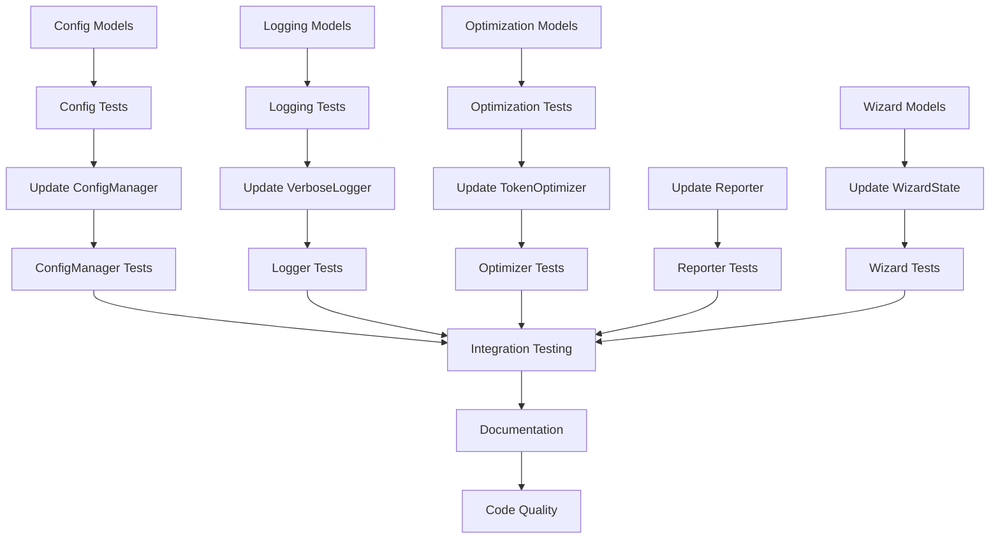

# Data Models Phase 2 - Tasks

## Overview

This document outlines the specific tasks for implementing Phase 2 of the data model refactoring.

## Task Breakdown by Component

### 1. ConfigManager Refactoring

#### 1.1 Create Configuration Models (8 hours)
- [ ] Create `browser_copilot/models/config.py`
- [ ] Implement ViewportConfig model with validation
- [ ] Implement BrowserConfig model with browser validation
- [ ] Implement ProviderConfig model with provider validation
- [ ] Implement OptimizationConfig model
- [ ] Implement ExecutionConfig model
- [ ] Implement StorageConfig model
- [ ] Implement AppConfig model with layer merging
- [ ] Add serialization methods to all config models

#### 1.2 Write Config Model Tests (6 hours)
- [ ] Test ViewportConfig validation (positive/negative dimensions)
- [ ] Test BrowserConfig validation (supported browsers)
- [ ] Test ProviderConfig validation (required fields)
- [ ] Test OptimizationConfig validation (compression levels)
- [ ] Test AppConfig layer merging (CLI > env > file > defaults)
- [ ] Test serialization/deserialization round trips
- [ ] Property-based tests with Hypothesis

#### 1.3 Update ConfigManager (4 hours)
- [ ] Add AppConfig as internal representation
- [ ] Implement model-based load() method
- [ ] Maintain backward-compatible get() method
- [ ] Update merge logic to work with models
- [ ] Add migration from dict to model format
- [ ] Add deprecation warnings for dict access

#### 1.4 Update ConfigManager Tests (2 hours)
- [ ] Update existing tests to verify compatibility
- [ ] Add tests for model-based interface
- [ ] Test migration scenarios
- [ ] Test deprecation warnings

### 2. VerboseLogger Refactoring

#### 2.1 Create Logging Models (6 hours)
- [ ] Create `browser_copilot/models/logging.py`
- [ ] Implement LogLevel and StepType enums
- [ ] Implement ExecutionStep model
- [ ] Implement ToolCall model with result truncation
- [ ] Implement TokenUsageLog model
- [ ] Implement ErrorLog model
- [ ] Implement LogSession model with aggregations
- [ ] Add JSON serialization for all models

#### 2.2 Write Logging Model Tests (4 hours)
- [ ] Test ExecutionStep creation and validation
- [ ] Test ToolCall result truncation
- [ ] Test TokenUsageLog calculations
- [ ] Test LogSession aggregations
- [ ] Test serialization with various data types
- [ ] Test model relationships

#### 2.3 Update VerboseLogger (6 hours)
- [ ] Replace dict storage with model instances
- [ ] Update log_step() to create ExecutionStep
- [ ] Update log_tool_call() to create ToolCall
- [ ] Update log_token_usage() to create TokenUsageLog
- [ ] Update log_error() to create ErrorLog
- [ ] Update get_execution_summary() to use LogSession
- [ ] Maintain backward-compatible interfaces

#### 2.4 Update Logger Tests (2 hours)
- [ ] Update tests for model-based logging
- [ ] Verify log file format compatibility
- [ ] Test summary generation
- [ ] Test callback integration

### 3. TokenOptimizer Refactoring

#### 3.1 Create Optimization Models (3 hours)
- [ ] Create `browser_copilot/models/optimization.py`
- [ ] Implement OptimizationStrategy enum
- [ ] Implement OptimizationMetrics model
- [ ] Implement CostAnalysis model
- [ ] Implement OptimizationResult model
- [ ] Add calculated properties

#### 3.2 Write Optimization Model Tests (2 hours)
- [ ] Test metrics calculations
- [ ] Test cost analysis calculations
- [ ] Test edge cases (zero tokens, etc.)
- [ ] Test serialization

#### 3.3 Update TokenOptimizer (4 hours)
- [ ] Replace dict metrics with OptimizationMetrics
- [ ] Update optimize_prompt() to return OptimizationResult
- [ ] Update get_metrics() to return model
- [ ] Update estimate_cost_savings() to return CostAnalysis
- [ ] Maintain backward compatibility

#### 3.4 Update Optimizer Tests (2 hours)
- [ ] Update tests for model returns
- [ ] Test metric accuracy
- [ ] Test cost calculations
- [ ] Verify optimization strategies

### 4. Reporter Refactoring

#### 4.1 Update Reporter Implementation (3 hours)
- [ ] Update print_results() to use BrowserTestResult model
- [ ] Update save_results() to use model serialization
- [ ] Update generate_summary() to use model properties
- [ ] Update generate_markdown_report() to use model
- [ ] Update create_html_report() to use model
- [ ] Remove all dict[str, Any] assumptions

#### 4.2 Update Reporter Tests (2 hours)
- [ ] Update test fixtures to use BrowserTestResult
- [ ] Verify output format compatibility
- [ ] Test with various result scenarios
- [ ] Test error handling

### 5. WizardState Enhancement

#### 5.1 Create Wizard Models (2 hours)
- [ ] Create `browser_copilot/models/wizard.py`
- [ ] Implement WizardHistoryEntry model
- [ ] Implement WizardConfig model
- [ ] Add conversion methods

#### 5.2 Update WizardState (2 hours)
- [ ] Replace dict history with WizardHistoryEntry list
- [ ] Update to_config() to return WizardConfig
- [ ] Update save_history() to create typed entries
- [ ] Maintain compatibility

#### 5.3 Update Wizard Tests (1 hour)
- [ ] Update tests for typed history
- [ ] Test config generation
- [ ] Test state restoration

### 6. Integration and Documentation

#### 6.1 Integration Testing (4 hours)
- [ ] End-to-end test with all new models
- [ ] Test component interactions
- [ ] Performance benchmarking
- [ ] Memory usage analysis
- [ ] Cross-platform testing

#### 6.2 Documentation Updates (3 hours)
- [ ] Update API documentation
- [ ] Create migration guide
- [ ] Update code examples
- [ ] Document new model structures
- [ ] Update type hints throughout

#### 6.3 Code Quality (2 hours)
- [ ] Run mypy in strict mode
- [ ] Run ruff for linting
- [ ] Ensure 100% test coverage
- [ ] Update CHANGELOG.md

## Task Dependencies

## Time Estimates

| Component | Implementation | Testing | Total |
|-----------|---------------|---------|-------|
| ConfigManager | 12 hours | 8 hours | 20 hours |
| VerboseLogger | 10 hours | 6 hours | 16 hours |
| TokenOptimizer | 7 hours | 4 hours | 11 hours |
| Reporter | 3 hours | 2 hours | 5 hours |
| WizardState | 2 hours | 1 hour | 3 hours |
| Integration | 4 hours | 5 hours | 9 hours |
| **Total** | **38 hours** | **26 hours** | **64 hours** |

## Definition of Done

- [ ] All models implement SerializableModel base class
- [ ] All models have comprehensive validation
- [ ] All models have 100% test coverage
- [ ] All components maintain backward compatibility
- [ ] All deprecation warnings are in place
- [ ] Mypy passes in strict mode
- [ ] All tests pass on Windows, macOS, and Linux
- [ ] Documentation is complete and accurate
- [ ] Performance benchmarks show no regression
- [ ] Code review completed

## Risk Mitigation

1. **Backward Compatibility Break**
   - Mitigation: Extensive compatibility testing
   - Fallback: Feature flag to disable new models

2. **Performance Degradation**
   - Mitigation: Benchmark before/after
   - Fallback: Optimize hot paths

3. **Complex Migration**
   - Mitigation: Automated migration tools
   - Fallback: Support both formats temporarily

4. **Serialization Issues**
   - Mitigation: Round-trip testing
   - Fallback: Custom serializers

## Success Metrics

1. **Code Quality**
   - Zero mypy errors
   - 100% test coverage
   - No ruff violations

2. **Performance**
   - No increase in memory usage
   - No increase in execution time
   - Efficient serialization

3. **Developer Experience**
   - IDE autocomplete works
   - Clear error messages
   - Easy to understand models

4. **Compatibility**
   - All existing code works
   - Smooth migration path
   - Clear deprecation timeline